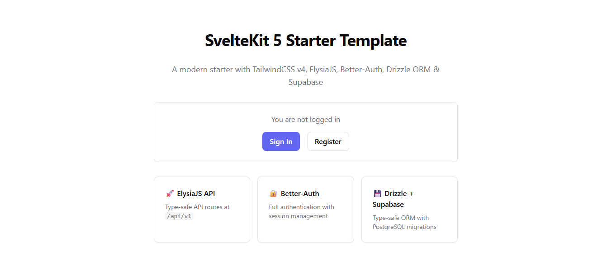

<p align="center">
  
</p>

# 🚀 SvelteKit 5 Starter Template

A modern, production-ready starter template with high-performance tech stack.

- ⚡ **SvelteKit 5** - Full-stack framework with Svelte 5 runes
- 🎨 **TailwindCSS v4** - Next-gen utility-first CSS
- 🚀 **ElysiaJS** - Type-safe API routes at `/api/v1`
- 🔐 **Better-Auth** - Full authentication system
- 💾 **Drizzle ORM** - Type-safe database operations
- 🗄️ **Supabase** - PostgreSQL database

## Prerequisites

- Node.js 20+
- pnpm (recommended)
- Supabase account

## Quick Start

### 1. Install dependencies

```bash
pnpm install
```

### 2. Configure environment

Copy `.env.example` to `.env` and fill in your values:

```bash
cp .env.example .env
```

Required variables:
- `DATABASE_URL` - Supabase connection string (use pooling mode)
- `BETTER_AUTH_SECRET` - Generate with: `openssl rand -base64 32`
- `BETTER_AUTH_URL` - Your app URL (http://localhost:5173 for dev)

### 3. Set up database

Push the schema to Supabase:

```bash
pnpm db:push
```

Or generate and run migrations:

```bash
pnpm db:generate
pnpm db:migrate
```
Other Commands:

```bash
npx svelte-kit sync
npx drizzle-kit generate
openssl rand -base64 32
npx @better-auth/cli generate
```
### 4. Start development

```bash
pnpm dev
```

### 5. Seed Database (Optional)

Create a default admin user:

```bash
pnpm db:seed
```

Default credentials: `admin@example.com` / `Password123!`


Open [http://localhost:5173](http://localhost:5173) in your browser.

## Project Structure

```
src/
├── lib/
│   ├── server/
│   │   ├── api/               # ElysiaJS API routes
│   │   │   ├── routes/        # Route modules
│   │   │   └── index.ts       # Main API app
│   │   ├── db/
│   │   │   ├── schema/        # Drizzle schemas
│   │   │   └── index.ts       # DB connection
│   │   └── auth.ts            # Better-Auth server config
│   └── auth-client.ts         # Better-Auth client
├── routes/
│   ├── api/v1/[...slugs]/     # ElysiaJS catch-all route
│   ├── (auth)/                # Auth pages (login, register)
│   ├── (protected)/           # Protected pages (requires auth)
│   └── +page.svelte           # Home page
├── app.css                    # TailwindCSS entry
├── app.d.ts                   # TypeScript types
└── hooks.server.ts            # Server hooks
```

## Available Scripts

| Script | Description |
|--------|-------------|
| `pnpm dev` | Start development server |
| `pnpm build` | Build for production |
| `pnpm preview` | Preview production build |
| `pnpm check` | Type check with svelte-check |
| `pnpm db:generate` | Generate Drizzle migrations |
| `pnpm db:migrate` | Run migrations |
| `pnpm db:push` | Push schema to database |
| `pnpm db:studio` | Open Drizzle Studio |
| `pnpm db:seed` | Seed database |
| `pnpm db:verify` | Verify database |


## API Routes

The ElysiaJS API is mounted at `/api/v1`. Example endpoints:

- `GET /api/v1` - API info
- `GET /api/v1/example` - Example endpoint
- `GET /api/v1/example/:id` - Get by ID
- `POST /api/v1/example` - Create item

Add new routes in `src/lib/server/api/routes/`.

## Authentication

Better-Auth handles authentication via:

- **Server**: `src/lib/server/auth.ts` - Configuration and API
- **Client**: `src/lib/auth-client.ts` - React hooks for auth state
- **Hooks**: `src/hooks.server.ts` - Handles auth requests

### Protected Routes

Routes under `(protected)/` require authentication. The layout server checks session and redirects to login if not authenticated.

## Database

Drizzle ORM with PostgreSQL via Supabase:

- **Schema**: `src/lib/server/db/schema/`
- **Connection**: `src/lib/server/db/index.ts`
- **Config**: `drizzle.config.ts`

### Getting Supabase URL

1. Go to your Supabase project dashboard
2. Navigate to **Settings** → **Database**
3. Copy the **Connection string** (use **Session pooling** for serverless)
4. Replace `[YOUR-PASSWORD]` with your database password
